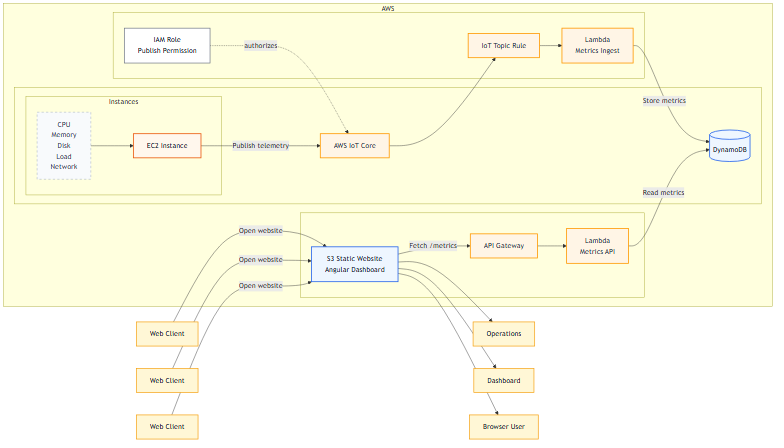
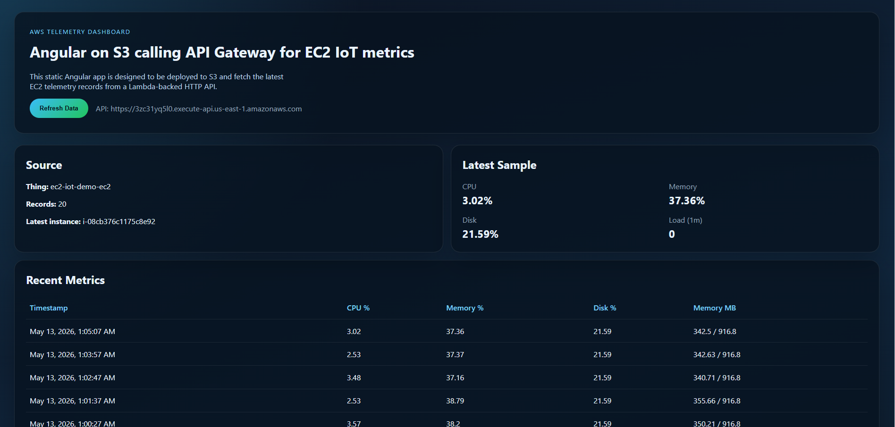
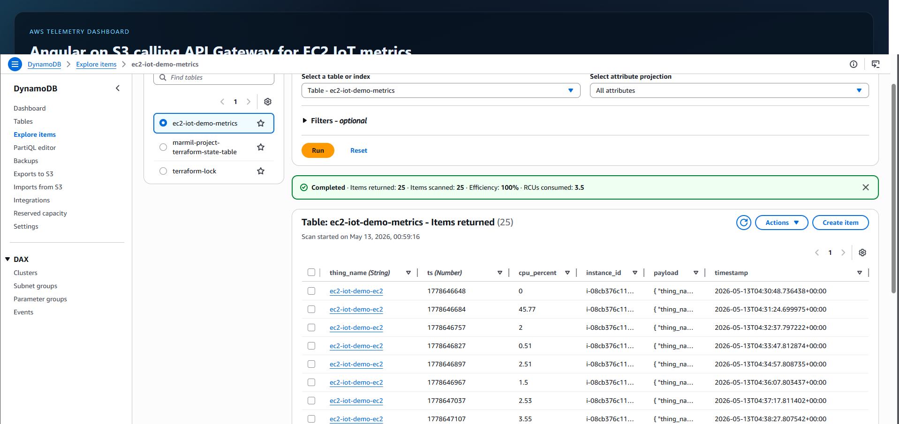
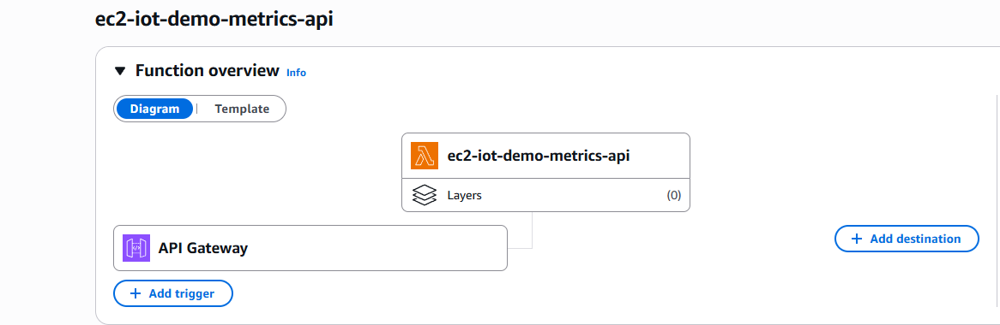
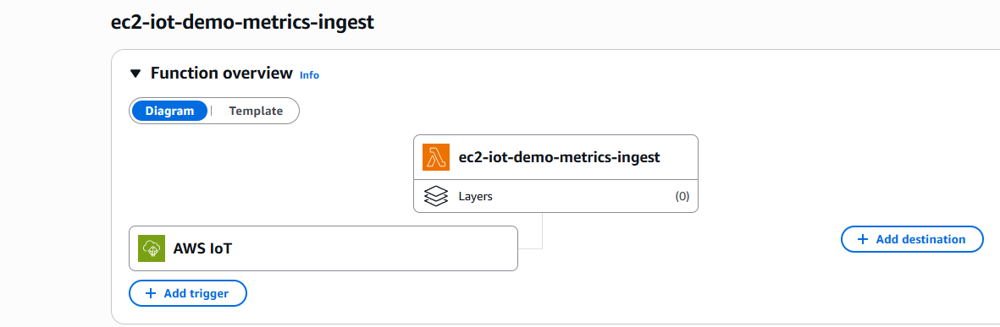
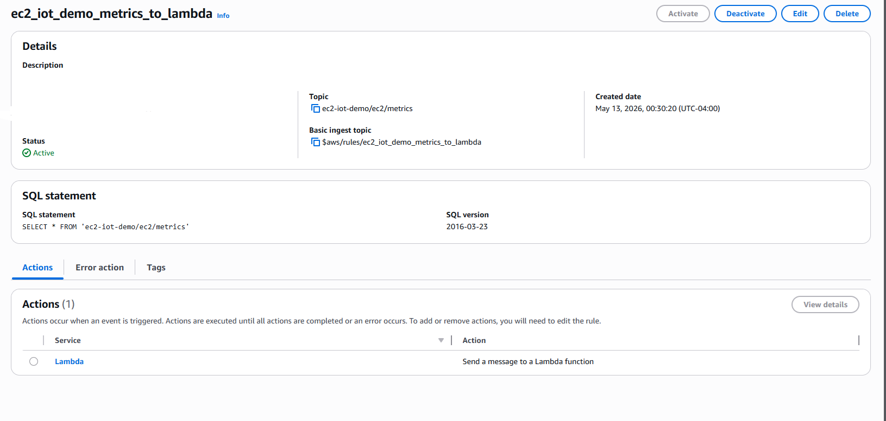
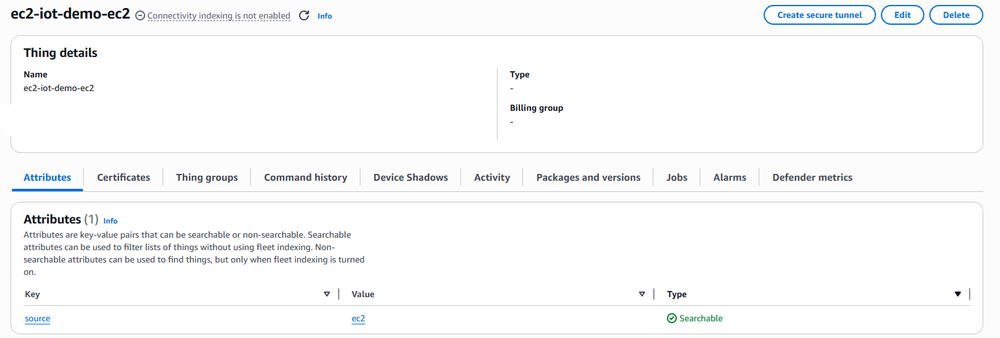

# EC2 IoT Telemetry Dashboard

An end-to-end AWS telemetry demo that turns a single EC2 instance into an IoT data source. The instance publishes system metrics to AWS IoT Core, Lambda ingests and stores them in DynamoDB, and an Angular dashboard hosted on S3 reads the latest records through API Gateway.

This repo is meant to show the full path from infrastructure provisioning to a working web dashboard, not just isolated service examples.

## Architecture

Telemetry moves through the stack in six steps:

1. EC2 collects CPU, memory, disk, load, and network metrics.
2. The instance publishes JSON payloads to AWS IoT Core.
3. An IoT topic rule invokes the ingest Lambda.
4. The ingest Lambda stores telemetry in DynamoDB.
5. A read Lambda behind API Gateway returns recent records.
6. An Angular frontend hosted on S3 renders the data.



## What This Deploys

- VPC, subnet, internet gateway, route table, and security group
- Amazon Linux EC2 instance publishing telemetry every 60 seconds
- IAM role and instance profile for Systems Manager and IoT publish access
- AWS IoT Core thing and topic rule
- Lambda ingest function and Lambda read API
- DynamoDB metrics table
- API Gateway HTTP API
- S3 static website for the Angular dashboard

## Repository Layout

```text
.
|-- frontend/
|   |-- src/
|   |-- angular.json
|   `-- package.json
|-- terraform/
|   |-- main.tf
|   |-- variables.tf
|   |-- outputs.tf
|   |-- cloud-config.yaml
|   |-- lambda_function.py
|   `-- lambda_api_function.py
`-- docs/
    |-- telemetry-architecture.mmd
    |-- telemetry-architecture.png
    `-- screenshots/
```

## Prerequisites

- Terraform 1.14+
- AWS CLI configured for the target account
- Node.js 20+ and npm
- AWS permissions for EC2, IoT Core, Lambda, DynamoDB, API Gateway, IAM, and S3

## Quick Start

Provision the infrastructure:

```powershell
Set-Location h:\aws\iot\terraform
terraform init
terraform apply
```

Key Terraform outputs:

- `metrics_api_url`
- `frontend_bucket_name`
- `frontend_website_url`
- `ssm_start_session_command`
- `iot_thing_name`

Build the frontend:

```powershell
Set-Location h:\aws\iot\frontend
npm install
npm run build
```

Publish the production build to S3:

```powershell
Set-Location h:\aws\iot\terraform
aws s3 sync ../frontend/dist/telemetry-web/browser s3://<frontend_bucket_name> --delete
```

Set the API base URL in [frontend/src/environments/environment.prod.ts](./frontend/src/environments/environment.prod.ts) before the final frontend build.

## Implementation Notes

- [terraform/cloud-config.yaml](./terraform/cloud-config.yaml) bootstraps the EC2 publisher and systemd timer.
- [terraform/lambda_function.py](./terraform/lambda_function.py) stores both the raw payload and flattened telemetry fields in DynamoDB.
- [terraform/lambda_api_function.py](./terraform/lambda_api_function.py) normalizes records for the dashboard response.
- The stack uses IAM-based publishing from EC2 to AWS IoT Core rather than device certificates.

## Verification

Query the deployed API directly:

```powershell
Invoke-RestMethod 'https://<api-id>.execute-api.<region>.amazonaws.com/metrics?limit=5' | ConvertTo-Json -Depth 8
```

Connect to the instance with Systems Manager:

```powershell
aws ssm start-session --target <ec2_instance_id> --region <aws_region>
```

Useful checks on the instance:

```bash
systemctl status ec2-iot-metrics.timer
systemctl status ec2-iot-metrics.service
journalctl -u ec2-iot-metrics.service -n 50 --no-pager
```

## Screenshots

### Dashboard

The Angular frontend shows the latest sample and a recent-metrics table sourced from the API.



### DynamoDB Items

Stored telemetry records include the EC2 source, timestamp, CPU usage, and the ingested payload.



### API Lambda Trigger

The read API is exposed through API Gateway and returns telemetry for the dashboard.



### Ingest Lambda Trigger

AWS IoT invokes the ingest Lambda whenever the EC2 publisher sends a message.



### IoT Rule

The topic rule subscribes to the telemetry topic and forwards matching messages to Lambda.



### IoT Thing

The EC2 instance is represented in IoT Core as a logical thing.



## Cleanup

Destroy the Terraform-managed resources:

```powershell
Set-Location h:\aws\iot\terraform
terraform destroy
```

If resources were deleted manually, refresh or remove local Terraform state before reusing the workspace.